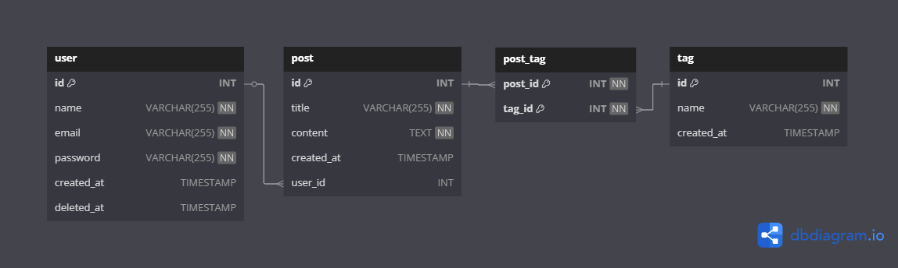

# 문제 2

아래의 요구 사항에 맞는 테이블을 설계하여 ERD를 작성해 주세요

기초 테이블 정의를 바탕으로 작성하며,
유저스토리에 따라 테이블의 수정 및 추가를 하실 수 있습니다

## 기초 테이블 정의

- **user** table은 이름(name), 이메일(email), 패스워드(password), 가입일(created_at)을 가지고 있다.
- **post** table은 글제목(title), 본문(content), 글 작성일(created_at), 작성자(user_id)를 가지고 있다
- **tag** table은 태그명(name), 태그 생성일(created_at)을 가지고있다

### 유저 스토리

- user는 post를 작성할수 있다
- user는 post는 복수의 tag를 추가 할수있다
- user는 탈퇴처리 처리가 가능해야한다
- user가 탈퇴 되더라도, post는 삭제되서는 안된다
- tag로 post를 검색할수 있어야 한다

---

작성한 ERD 링크입니다.
https://dbdocs.io/gkemg2017/Backend-test-solve2?view=relationships

1. user는 post를 작성할수 있다
->  post 테이블에 user_id 컬럼을 추가하여 user_id는 user 테이블의 id를 참조 (FK)
    FOREIGN KEY ('user_id') REFERENCES 'user'('id') ON DELETE SET NULL
    'post.user_id'를 'user.id'와 연결하여, 각 포스트가 작성자를 가지도록 적용

2. user의 post는 복수의 tag를 추가할 수 있다.
->  'user'테이블과 'post'테이블은 그대로 연결 시 다대다 관계이므로 중간 테이블로 'post_tag' 테이블을 추가
    'post_tag' 테이블에서 'post_id', 'tag_id'를 조합하여 게시글과 태그를 연결

CREATE TABLE `post_tag` (
    `post_id` INT NOT NULL,
    `tag_id` INT NOT NULL,
    PRIMARY KEY (`post_id`, `tag_id`),
    FOREIGN KEY (`post_id`) REFERENCES `post`(`id`) ON DELETE CASCADE,
    FOREIGN KEY (`tag_id`) REFERENCES `tag`(`id`) ON DELETE CASCADE
);

3. user는 탈퇴 처리가 가능해야 한다
->  'user'테이블에 'deleted_at' TIMESTAMP NULL 컬럼을 추가
    'deleted_at'이 null이면 회원 상태, 값이 있으면 탈퇴 상태로 적용함으로써 유저 데이터를 삭제하지 않고 탈퇴한 상태로 적용

4. user가 탈퇴되더라도, post는 삭제되면 안된다
->  'post.user_id'가 'user.id'를 참조할 때 ON DELETE SET NULL 설정
    FOREIGN KEY ('user_id') REFERENCES 'user'('id') ON DELETE SET NULL
    'user'가 탈퇴처리 되어도 post.user_id 값을 null로 변경해서 게시글을 유지

5. tag로 post를 검색할 수 있어야 한다
->  'post_tag' 테이블을 이용해 특정 'tag_id'가 연결된 'post_id'를 조회 가능
    
    SELECT p.*
    FROM post p
    JOIN post_tag pt ON p.id = pt.post_id
    JOIN tag t ON pt.tag_id = t.id
    WHERE t.name = '특정 태그명';

    'post_tag' 테이블을 활용하여 위 쿼리로 특정 태그가 달린 모든 게시글 검색 가능

### 💡 추가질문 - 성능을 개선하기 위한 아이디어를 제시해 주세요

1. 데이터가 대량으로 쌓일 경우를 대비해 각 컬럼들에 인덱스를 추가하여 쿼리 성능을 개선할 수 있습니다.
예를 들면 'user.email' 컬럼에 unique index를 추가하여 로그인 시 이메일을 더욱 빠르게 검색해서 성능 향상을 시킬 수 있고, 중복된 이메일도 방지할 수 있습니다.
'post.created_at' 컬럼에 index를 추가하면 시간별 정렬 조회 성능이 향상될 수 있습니다.

2. 1번의 인덱스 추가에서 더 나아가 'post_tag' 테이블에 복합 인덱스를 추가하는 것도 고려할 수 있습니다.
'post_id'와 'tag_id'를 결합해 하나의 복합 인덱스를 만들면 tag로 post를 검색하는 쿼리에서 성능이 개선됩니다. 

3. DB를 파티셔닝하여 대량의 데이터가 쌓였을 때 분산시키는 것을 고려할 수 있습니다.
예를 들어 'post' 테이블을 'created_at' 컬럼 기준으로 파티셔닝하면 특정 기간(월별, 분기별, 또는 연도별)의 게시글을 조회하는 성능이 향상됩니다.

4. 자주 조회되는 게시글, 태그 등에 대하여 캐싱처리(Redis 등)를 해서 DB에 접근하지 않고 조회할 수 있도록 하여 성능을 개선시킬 수 있습니다.
예를 들어 'post' 테이블에 view_count 라는 컬럼을 추가하고, 게시글이 조회될 때마다 값을 증가시킵니다. 조회 횟수가 일정 값에 도달하면 Redis 캐시에 데이터를 저장합니다.
데이터 조회 시 먼저 Redis 캐시에서 데이터를 확인하고 찾으면 빠르게 반환할 수 있습니다.