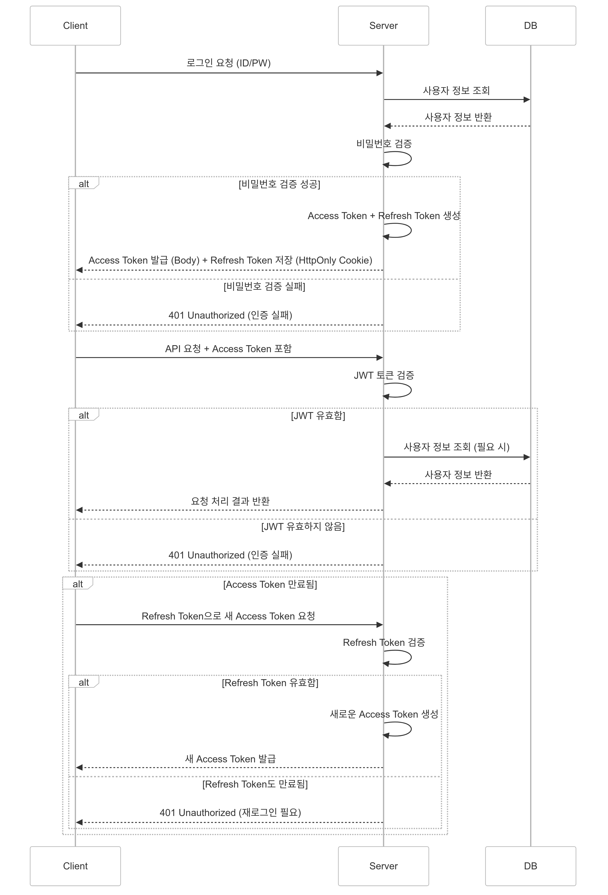

# 문제 3

사내에서 쓰이는 BO(Back office) 서비스를 개발하려고 합니다.

1. 로그인방식인 OAuth와 JWT 둘중에 어느것을 사용하여 개발을 하실건가요?  
JWT를 사용하여 개발하도록 하겠습니다.
  
2. 둘중 선택한 이유와 장점에 대해 설명해주세요  
BO 서비스는 내부 시스템이고, 비교적 서비스 규모가 작기 때문에 OAuth보다 JWT가 적합하다고 생각합니다.  
  
- 보안 측면  
JWT는 비밀키로 서명된 토큰을 통해 서버와 클라이언트가 정보를 주고 받습니다.  
이 토큰은 변조를 방지하고, 토큰 자체에 인증 정보가 담겨 있어서 안정성이 보장됩니다.  
  
- 독립적인 측면  
OAuth와 같은 외부 서버에 의존하여 개발할 시, 서버에 장애가 발생할 경우 외부 서버에서 해결되기 전까지 직접 해결하기 힘들다는 점이 있습니다.  
반면에 JWT로 구현 시 내부적으로 인증을 처리하기 때문에 장애가 발생하더라도 서버 측에서 빠르게 디버깅을 통해 조치할 수 있다는 장점이 있습니다.  
  
- 성능 측면  
JWT는 세션을 저장하지 않고 클라이언트가 상태 정보를 토큰에 포함하여 서버와 통신합니다.  
이를 통해 서버 측에서 상태를 저장할 필요가 없어 서버의 부담을 줄여 성능을 향상시킬 수 있습니다.
  
- 구현 측면  
OAuth에 비해 설정과 구현이 비교적 간단하기 때문에 작은 규모의 BO 서비스에서 더욱 적합합니다.

3. 구현 방법을 서술해 주세요 (다이어그램등을 활용하셔서 첨부하셔도 좋습니다)  
- 사용자 로그인 요청  
1. 사용자가 로그인 폼에 아이디와 비밀번호를 입력하고 로그인 요청을 서버로 보냄
2. 서버는 DB에서 해당 사용자의 정보를 조회하고, 입력된 비밀번호를 검증
  
- JWT 토큰 생성 및 응답  
1. 사용자의 인증 정보가 올바르면, 서버에서 Access Token과 Refresh Token 토큰을 생성  
 - Access Token (만료 시간 15-60분), Refresh Token (만료 시간 1-2주)  
 - Access Token에 'userId', 'roles' 등의 정보를 포함시킴  
2. Access Token은 HTTP 응답 Body에 포함하여 클라이언트에 전달  
3. Refresh Token은 보안을 위해 HttpOnly Cookie에 저장  
4. 사용자의 인증 정보 검증이 실패하면, 401 Unauthorized 에러 반환
  
- 클라이언트의 요청에 JWT 토큰 포함  
1. 클라이언트가 서버에 API 요청을 보낼 때 Autorization: Bearer <JWT-TOKEN> 형식으로 JWT를 포함시켜 보냄  
  
- 서버에서 JWT 검증  
1. 서버가 클라이언트로부터 받은 JWT 토큰을 비밀키를 이용해 검증 후, 유효할 시 요청 처리
2. 유효하지 않은 토큰일 땐 401 Unauthorized 예외 반환  
  
- 토큰 만료 처리  
1. Access Token의 만료 시간이 지나면, 클라이언트는 Refresh Token을 사용해서 서버에 새로운 Access Token 요청  
2. 서버가 Refresh Token을 검증하교 유효할 시, 새로운 Access Token을 발급해서 반환  
3. Refresh Token도 만료되었으면 다시 로그인  
  
인증 흐름 예시 다이어그램  

---

### 💡 추가질문 - 실제로 구현해본 경험이 있다면, 해당 구현 경험을 서술해주세요  
Java, Spring Boot 기반으로 된 프로젝트에서 Spring Security를 활용하여 보안 설정을 구성하고, JWT 기반 인증을 구현을 해본 경험이 있습니다.  
  
1. JWT 토큰 생성 및 검증  
JWT를 이용하여 사용자 인증을 처리하기 위해 JwtUtil 클래스를 작성했고, 이 클래스는 JWT 토큰 생성, Access Token/Refresh Token 관리, 토큰 검증을 담당했습니다.  
- 토큰 생성: 사용자가 로그인 시, 사용자 정보를 기반으로 accessToken, refreshToken을 생성했습니다. 요청 시 해당 토큰을 이용해 인증을 받게 구현했습니다.  
- 유효성 검증: 토큰의 유효성을 검사하는 validateToken() 메서드를 구현했습니다. JWT 토큰의 서명이 유효한지를 체크하여 인증을 보장했습니다. 만약 토큰이 유효하지 않으면 인증 실패 처리됩니다.  
- 토큰 파싱: parseToken() 메서드를 통해 토큰 내의 claims를 추출하고, 여기서 사용자 정보와 권한을 확인하도록 했습니다.  
  
2. JWT 필터 설정  
JwtAuthenticationFilter 클래스를 작성해서, 모든 API 요청에서 JWT 토큰을 검사하도록 필터링을 구현했습니다.  
- 인증 처리: 토큰을 요청 헤더에서 추출 후, JWT 유효성 검증을 시행한 뒤 토큰이 유효하면 SecurityContextHolder에 인증 정보를 저장해서 인증된 사용자로 처리합니다. 해당 토큰에서 사용자 이메일을 추출하고 이후 요청에서 현재 인증된 사용자 정보에 접근할 수 있도록 처리했습니다.  
  
3. Spring Security 설정  
Spring Security의 보안 필터 체인을 설정했습니다.  
- 보안 필터 체인: HttpSecurity 객체를 통해서 기본적인 인증과 권한 설정을 구현했습니다. 예를 들어 관리자 페이지는 ADMIN role을 가진 사용자만 접근하도록 했고, 로그인 페이지 관련 요청은 누구나 접근 가능하게 구현했습니다.  
- JWT 필터 통합: JWT 인증 필터는 addFilterBefore 메서드를 사용해 UsernamePasswrodAuthenticationFilter 앞에 추가하여 Spring Security 보안 필터에 통합했습니다.  
- CSRF 방지: JWT를 사용할 경우 세션을 사용하는 CSRF 토큰이 필요없으므로 csrf(AbstractHttpConfigurer::disable) 처리를 했습니다.  
  
4. 인증 흐름 구현  
- 사용자가 로그인 화면에서 id, password를 입력 시, 서버는 사용자 정보를 인증한 뒤 accessToken과 refreshToken 생성하여 반환  
- 이후 사용자가 요청을 보낼 때 Authorization 헤더에 JWT를 포함시켜 서버로 전송  
- 서버에서 JWT 인증 필터로 해당 토큰을 검증하고, 유효한 토큰일 경우 사용자의 인증 정보를 SecurityContextHolder에 저장  
- 저장 이후에는 인증된 사용자로 처리되어 필요한 후속 요청 처리를 수행  
  
5. 구현 시 신경쓴 부분  
- 토큰 만료 처리: 토큰이 만료된 경우, 클라이언트에서 자동으로 refreshToken을 사용해 새로운 accessToken을 받아올 수 있도록 해서 사용자 경험을 개선했습니다.  
- 성능 최적화(DB 접근 최소화): JWT 토큰의 유효성을 검사할 때, 매번 DB를 조회하지 않고 토큰 내 claims를 통해 사용자 권한이나 정보를 빠르게 파싱하여 인증을 처리해서 서버의 부하를 줄였습니다.  
- 보안 강화: 비밀번호는 Bcrypt로 암호화하여 저장했습니다.  

