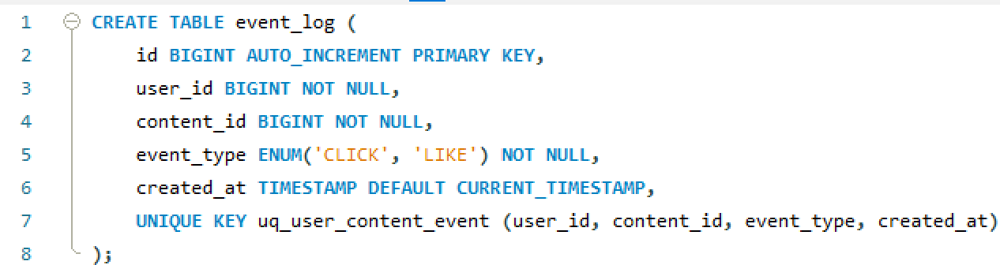
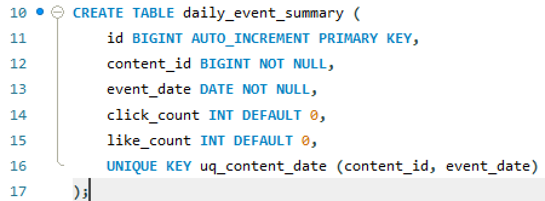
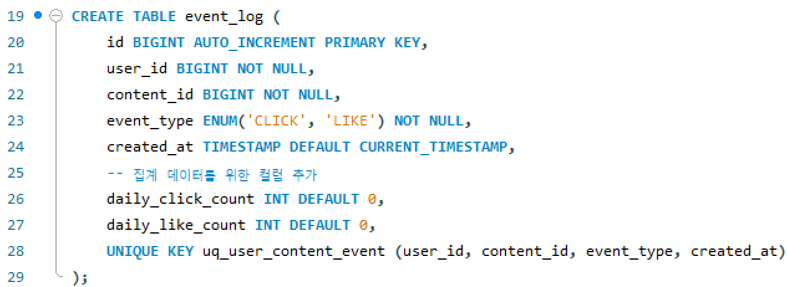
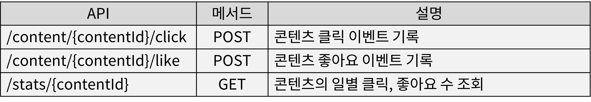

# 문제 4

아래의 요구조건에 맞는 설계를 진행하고, 이유를 설명해주세요

작은 스타트업에서 BO 서비스에서 통계 서비스를 개발하여 합니다

1. 각 콘텐츠의 유저의 클릭수, 좋아요수를 보여주는 그래프를 그려야 합니다
2. 클릭과 좋아요 수는 BO의 대시보드에서 확인이 가능하며, 새로고침 버튼을 눌러서 갱신 가능합니다
3. 그래프는 일일 단위로 합계로 표시됩니다
  ------
1. 요구사항 분석  
- 각 유저의 클릭 수, 좋아요 수를 기록하고 그래프로 제공  
    - 각 콘텐츠 별 클릭, 좋아요 수를 DB에 저장  
    - 일별 집계된 데이터 제공  
- BO 대시보드에서 새로고침 버튼으로 최신 데이터 조회 가능  
    - 실시간으로 저장된 데이터를 빠르게 조회 가능해야 함  
    - 백엔드 API를 통해 데이터를 제공  
- 그래프는 일일 단위로 합계 표시  
    - 하루 단위의 합산 데이터 사용  
    - 매일 정해진 시간에 배치 작업을 수행하여 데이터를 집계  
  
2. 시스템 설계  
- 데이터를 수집하는 과정과 조회하는 과정 분리  
- 실시간 저장과 일일 집계를 분리  
- 데이터가 쌓이므로 저장 방식을 효율적으로 구현 필요  
  
- 실시간 이벤트 저장  
    - 사용자가 클릭, 좋아요 이벤트를 발생시키면 DB, Redis에 기록  
    - 저장은 실시간으로, 조회는 집계된 데이터를 사용  
- 일일 단위 집계  
    - 매일 배치 프로세스를 통해 각 콘텐츠의 클릭 수, 좋아요 수를 집계  
    - 기존 데이터와 중복 저장을 방지하기 위해 UPSERT(UPDATE + INSERT) 방식 사용  
- 대시보드 API  
    - 집계된 데이터를 API로 제공  
    - 빠른 응답 속도를 위해 인덱스나 캐싱 적용  
  
3. 데이터 모델 설계  
- 이벤트 로그 테이블  
    - 개별 클릭 및 좋아요 이벤트를 기록하는 테이블  
    - 이벤트 중복 방지를 위해 Unique 키 또는 Redis 활용  
    - 빠른 조회를 위해 파티셔닝 활용 고려해볼 수 있음  
      
  
- 집계 테이블  
    - 하루 단위로 집계된 데이터를 저장하는 테이블  
    - 조회 성능을 고려해서 인덱스 설정 (콘텐츠 ID + 날짜)  
      
  
- 생각해볼 수 있는 테이블  
    - 데이터량이 적다면 두 개의 테이블을 단일 테이블로 통합하는 방식으로도 고려해볼 수 있음  
    - 구조가 간단하고 DB 설계가 쉽지만, 성능면이나 확장성을 고려해보면 아쉬운 부분이 있다고 볼 수 있음  
      
4. API 설계  
  
  
5. 데이터 집계 및 조회 최적화  
- 일일 단위 통계 집계 방식  
    - 하루동안 발생한 클릭, 좋아요 이벤트를 집계하여 배치 작업으로 집계 테이블에 저장 후 실시간 데이터는 초기화(다음 날의 집계 작업)  
    - ON DUPLICATE KEY UPDATE 또는 MERGE 를 사용해서 중복 삽입 방지  
- 조회 속도 최적화  
    - 자주 조회되는 데이터를 캐싱처리  
    - 인덱싱으로 최적화해서 빠르게 조회할 수 있도록 설계  

---

### 💡 추가질문 1. - 실제로 구현해본 경험이 있다면, 해당 구현 경험을 서술해주세요  
비록 실시간 클릭수나 좋아요수 집계와 관련된 서비스를 직접 구현한 경험은 없지만, 예약 관리 프로젝트를 개발하면서 실시간으로 예약 상태를 관리하는 시스템을 설계한 경험이 있습니다.  
  
해당 프로젝트에서는 예약 상태를 '대기', '완료', '취소' 등으로 관리하고, 상태 변경에 따라 후속 처리가 자동으로 이루어지도록 설계했습니다.  
예약 엔티티의 Enum 값을 활용하여 상태가 변경될 때마다 시스템에서 적절한 처리가 진행되도록 구현했습니다.  
  
이 프로젝트를 개발하며 통해 실시간 데이터의 흐름을 관리하고, 상태 변경에 따른 로직 흐름을 세밀하게 설계하는 방법을 배웠습니다.  
이를 기반으로 집계와 같은 이벤트를 관리하는 데 필요한 데이터 처리 및 실시간 갱신을 잘 구현할 수 있을 것입니다.  
  
### 💡 추가질문 2. - 유저가 클릭을 조작하기위해 빠르게 연타를 한다면, 어떻게 방지할수 있을까요?
